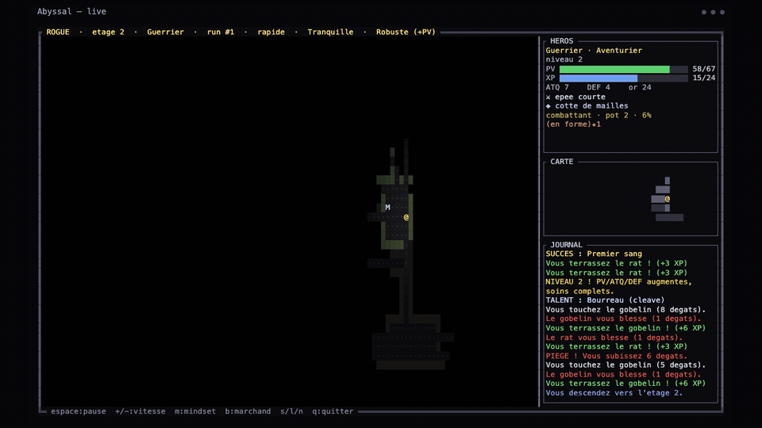
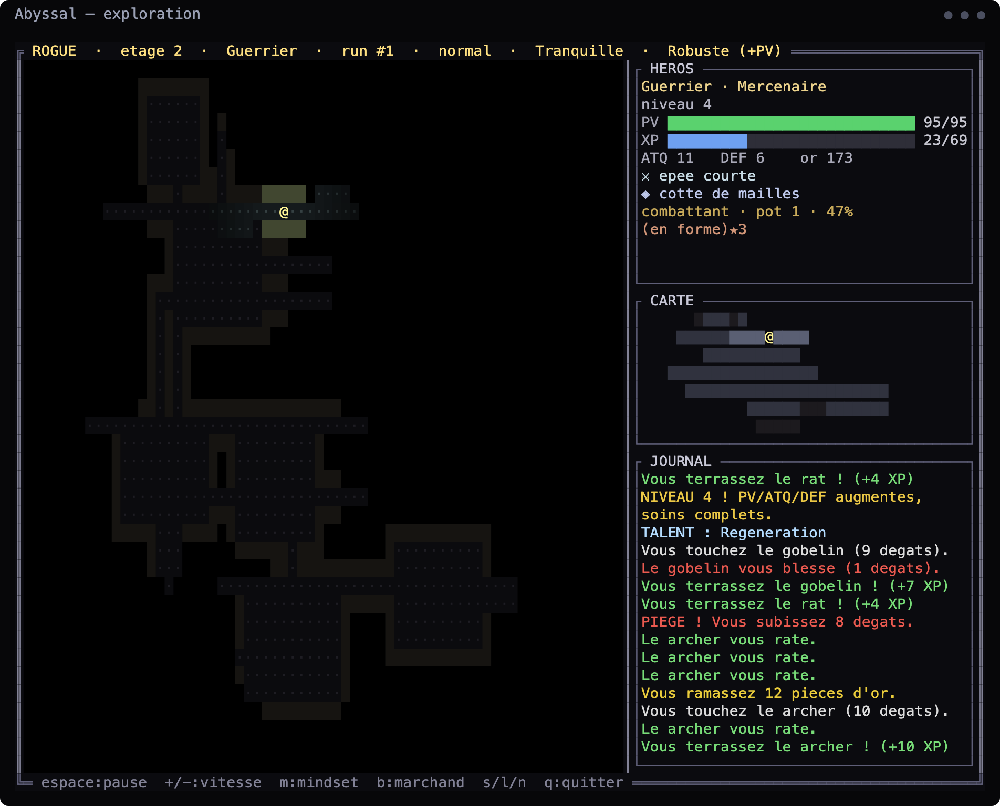
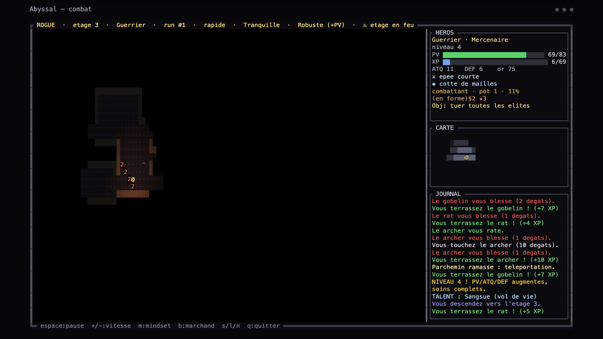
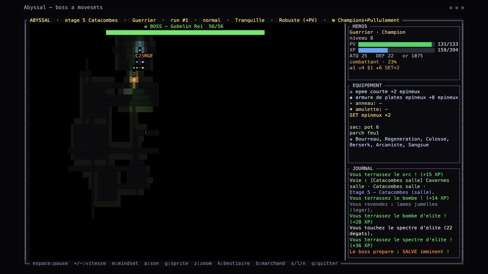
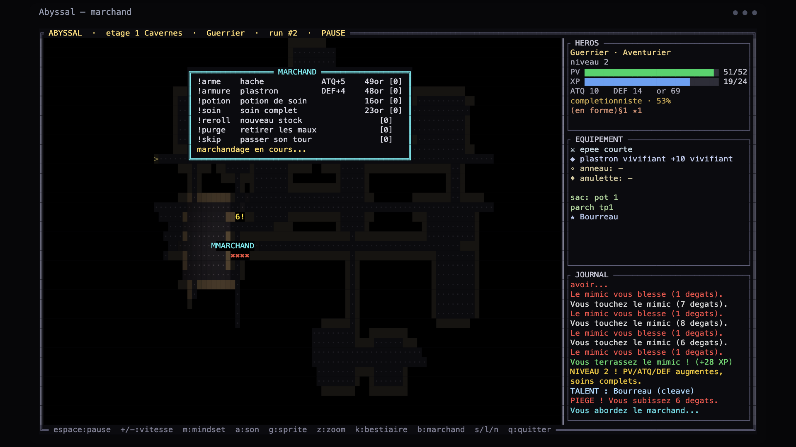
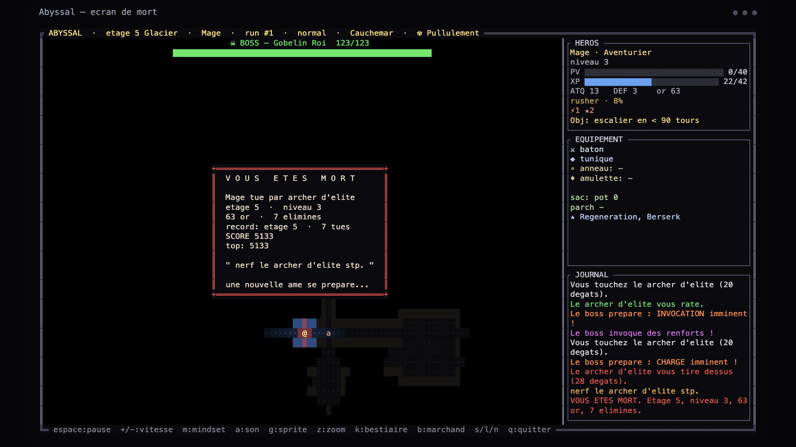
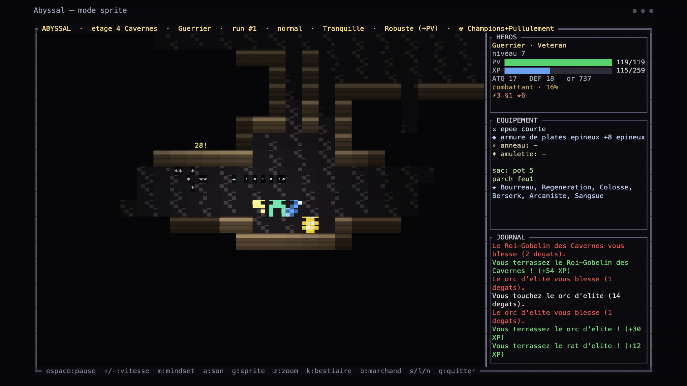
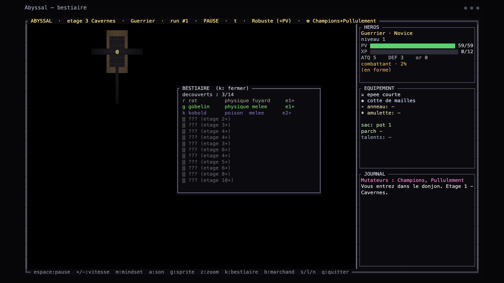

# Abyssal

*Read this in [Français](README.fr.md).*

A fully autonomous, watch-only roguelike for the terminal, written in Rust.

An AI heroine descends alone into an endless procedurally generated abyss: she explores, fights, loots, levels up, learns talents, trades with rare merchants, dodges telegraphed boss attacks, dies, and starts again — all on her own. You don't play. You watch.



## Screenshots

Exploration — a torch-lit field of view across a biome (note the palette, the full equipment panel and the active run mutator in the top bar).



Combat — floating damage, elemental hits and kill combos against biome-flavored fauna.



Boss movesets — bosses cycle telegraphed attacks (here a charge) and flash the danger tiles red; deeper moves leave lingering hazards the heroine must avoid.



Merchant — a rare trader appears with rolled stock; viewers can vote on the purchase when Twitch mode is on, and the simulation pauses during the deal.



Death — a cause-coherent death card with score, best scores, and a fittingly dramatic last word before a new soul descends.



Sprite mode — toggle `g` for a half-block pixel-art camera with procedural sprites (zoom with `z`); everything is still drawn in the terminal, no asset files.



Bestiary — toggle `k` for a codex of discovered monsters with their element, behavior and depth.



## Run

```sh
cargo run --release
```

Abyssal opens in **its own window** (via `minifb` — Windows, macOS, Linux X11 & Wayland), no terminal needed. The world is drawn with full-resolution procedural sprites and the HUD with an 8×8 bitmap font; it autoloads your save (or starts a fresh random run). Press `n` for a new run, `d` for the daily challenge.

## Controls

The game plays itself. Input is optional:

| Key | Action |
| --- | --- |
| `space` | pause / resume |
| `+` / `-` | faster / slower (lent → ultra) |
| `m` / `1` `2` `3` | cycle / set the heroine's mindset |
| `a` | mute / unmute sound |
| `o` | open the in-game options menu (pauses the game) |
| `g` | toggle sprite view (half-block pixel-art) / classic glyph map |
| `z` | cycle sprite-view zoom |
| `k` | open / close the bestiary codex |
| `h` | open / close the Hall of Souls (past heroines + active nemeses) |
| `d` | start the **daily challenge** (same dungeon for everyone that day) |
| `b` | (debug) spawn a test merchant |
| `s` / `l` | save / load |
| `n` | new run |
| `q` / `esc` | save & quit |

Progress autoloads on launch (`abyssal.save.json`).

## Features

### World & exploration
- **World generation v2** — each biome uses its own algorithm: cellular-automata caves, dense BSP crypts, wide great halls, room+cave hybrids and loop-heavy labyrinths, with round rooms, pillared halls, guaranteed connectivity and stairs placed far away for pacing.
- **Eleven biomes** (Caverns, Catacombs, Frostvault, Emberdepths, Abyss, Fungal Gardens, Ruined Forge, Sunken Sanctuary, Obsidian Hive, Caldera, Crystal Gallery) — each with its own palette, lighting tint, fauna, ambient hazard, a themed champion, a ground-decor layer and musical key.
- **Branching descents** — at each stairway the AI weighs 2–3 paths (treasure / challenge / warren / rest), heading for a Rest branch when wounded.
- **Rift rooms** — rare purple "parallel world" floors packed with elites and loot, a guaranteed relic on entry, and an over-leveled "Guardian of the Rift".
- **Features & events** — curse altars, shrines, blessing fountains, mimic chests, a rare Forge, gamble shrines, ghost graves, traps (some stunning) and per-floor events.
- **Abyss corruption** — a gauge that climbs with depth (and ascension): the deeper the run, the more it inflates monster HP and damage, and past a threshold foes start spawning enraged. Shown live in the heroine panel.
- **Two render modes** (`g`) — classic colored glyphs, or a half-block pixel-art sprite camera with detailed 8×8 procedural sprites (outlines + shading), particles and floating damage, and a wide zoom range from far-out to close-up (`z`).

### Lives, not just runs
- **Procedural identity** — every heroine is born with a name, an origin and a personality trait (brave, greedy, coward, reckless, curious, vengeful) that actually bends the AI: a coward bails and heals early, a reckless one fights to the last sliver of HP, a greedy one never leaves gold behind.
- **Thought log** — a live first-person narration along the bottom of the screen tells you *why* the heroine acts as she does (*"Too hurt (18%), I'm pulling out."*, *"The boss is mine."*, *"My head's spinning… I can't move."*) — built for watching and streaming.
- **Procedural obituary** — the death screen writes a one-of-a-kind epitaph referencing the run: name, origin, trait, depth reached, kills, and how it ended.
- **Nemeses** — wound a fleeing monster and let it escape, and it can return across runs, named and ranked up, hunting you down; killing it settles the score and retires it. Persisted in your lifetime profile.
- **Ghost graves** — fallen heroines are buried in the abyss. Later runs can find a past heroine's grave and reclaim their gold, a potion and a piece of their gear.

### Heroines, classes & gear
- **Twenty classes** (Warrior, Rogue, Mage, Paladin, Necromancer, Ranger, Berserker, Elementalist, Monk, Druid, Templar, Warlock, Shaman, Valkyrie, Spellblade, Sentinel, Reaper, Spectre, Maelstrom, Lich) — each with its own weapon/armor, crit, cleave/bolts and a cooldown ability.
- **Active abilities** — charge, blink-strike, ice/elemental nova, smite-heal, raise-dead, arrow volley, whirlwind, plus **spectral** ones: Vortex (pull every nearby monster to you), Possession (turn a monster into an ally) and Phase (blink through walls).
- **Gear** — 5 weapon families (light / heavy / staff / fists / bows) and 4 armor families (cloth / leather / plate / mail), each with 5–6 tiers; rings, amulets, scrolls, rarity and affixes, set bonuses, and a live loadout panel.
- **Relics** — unique drops (lifesteal, ghostly dodge, chain lightning, burning hits, +max HP, raise-dead, low-HP frenzy, greed) and rare single-use ancient relics (Ancient Eye reveals the whole floor through walls, Hourglass freezes every non-boss, Chalice of Life full-heals and grants +max HP).
- **Eight level-up talents** — berserk crit, lifesteal, +max HP, cleave, chain lightning, regen, scout (+vision), steel skin (−incoming damage).

### Combat
- **Cinematic combat** — hit-stop briefly freezes the action on crits, kills and boss hits so the effects are visible even at high speed; bosses and elites are tanky for longer, epic showdowns.
- **Depth** — weapon procs (bleed, armor-sunder) on top of the elemental affixes, universal crit-bleed and low-HP execute finishers.
- **Elemental system** (fire / ice / poison / lightning) — offensive weaknesses, on-hit effects, armor resistances, and synergies (shatter frozen foes, arcing lightning, spreading poison).
- **~45 monster kinds** with distinct behaviors (ranged casters, healers, fleeing skirmishers, summoners, kamikazes, enraging bosses) and a codex (`k`); floor bosses and a final boss with telegraphed phase-based movesets.

### Allies
- **Lost human companions** — rare survivors who join you with a role (guard / huntress / medic), follow across floors, level up and fight at your side (up to two).
- **Familiars** — striker, mender (heals you) or guardian, leveling up with the heroine.
- **Summoned allies** — the Necromancer/Lich raise or possess foes into temporary fighters.

### Modes & meta
- **Six AI playstyles** — completionist, fighter, rusher, looter, cautious, hunter — each reshaping the heroine's behavior.
- **Boss Rush variant** — floors 1–9 to gear up, then floor 10 becomes an endless arena: a stronger boss surges in the instant one dies (no descent, no saving), wave counter driving difficulty and score.
- **Run mutators** (Sanguinaire, Cupidite, Fragile, Pullulement, Champions, Titans, Soif de Sang, Frenesie) that twist spawns, scaling and rewards.
- **Ascension / NG+** and a persistent lifetime profile with milestones that unlock permanent starting bonuses.
- **Feats** — lifetime achievements (first blood, boss slayer, nemesis hunter, grave robber, deep diver, exterminator, survivor, heart of the abyss, …) that toast when earned and are tracked across runs in the Hall of Souls (`h`).
- **Daily challenge** (`d`) — a dungeon seeded from the date, identical for everyone that day; the death screen prints a shareable `DEFI #<day> — floor X, score Y` line, your best of the day and your all-time daily record. A **local leaderboard** of best score/floor per day is kept in the profile and shown in the Hall of Souls (`h`).

### Audio
- **Procedural 8/16-bit chiptune**, generated at runtime with no audio files: synthesized SFX, plus an **adaptive** chill-pop track that reacts live — the **tempo ramps up smoothly as enemies approach** and a driving arpeggio fades in, peaking in combat and against bosses, all by shifting tempo and layering rather than hard-cutting tracks.

### Twitch (optional)
- Viewers vote on the heroine's mindset and merchant purchases, shown in a live on-screen **panel** (channel, mindset-vote bars, top chatters, a feed of recent actions).
- **Viewer pseudos land on mobs** — an active chatter "adopts" a monster, whose name floats above it on the map.
- The **merchant shows a clear "VOTE NOW" call-to-action** with a countdown while the vote window is open.
- All Twitch options are adjustable from the in-game options menu.

## Possible builds

A "build" is the combination of everything you can set up and grow over a run. Counting the independent axes:

| Axis | Options |
| --- | --- |
| Class | 20 |
| Playstyle (mode) | 6 |
| Difficulty | 4 |
| Starting boon | 4 |
| Variant (Normal / Boss Rush) | 2 |
| Weapon affix (incl. none) | 9 |
| Armor affix (incl. none) | 3 |
| Ring affix (incl. none) | 9 |
| Amulet affix (incl. none) | 3 |
| Talent combinations (8 talents, one of each max) | 2⁸ = 256 |
| Relic combinations (8 relics) | 2⁸ = 256 |

Pre-game setup alone: 20 × 6 × 4 × 4 × 2 = **3,840** starting configurations.
In-run build identity (affixes × talents × relics): 9 × 3 × 9 × 3 × 256 × 256 ≈ **47.8 million**.

Multiplied together that is roughly **180 billion** theoretical builds (≈ 1.8 × 10¹¹) — and that is *before* counting the 5 weapon families × 6 tiers, 4 armor families × 5 tiers, 3 familiar types and 3 companion roles, which push the real variety far higher.

## Config

`abyssal.config.json` is created on first run. Fields:

- `sound_enabled` / `ambient_enabled` — SFX and the music track on/off
- `master_volume` / `ambient_volume` — SFX and music levels, 0.0–2.0 (also tweakable in the in-game options menu `o`)
- `music_preset` — music style: 0 = Auto (per biome), or a fixed preset (Chill / Energique / Sombre / Retro 8-bit / Mystique)
- `pathfinder` — heroine navigation algorithm: 0 BFS, 1 A*, 2 Dijkstra (weighted, danger-aware), 3 Greedy, 4 Diagonal (8-way), 5 JPS (jump point search)
- `twitch_enabled`, `twitch_channel`, `vote_window_secs`, `allow_style_vote`, `allow_speed_vote`, `allow_merchant_vote`, `allow_chaos_vote` — the optional Twitch integration
- `allow_bet_vote` — let viewers `!bet <floor>` on the heroine's death depth
- `render_scale` — internal supersampling factor (1–4, default 2): higher = finer/sharper text and crisper detail (the window renders at this multiple of the base resolution). Takes effect on relaunch. Also in the in-game options menu (`o`).
- `window_scale` — minifb window scale (0 = FitScreen, 1 = native, 2/4 = integer upscale)
- `obs_overlay` — when true, writes a self-refreshing `abyssal.obs.html` (transparent background, large fonts) ~4×/s; add it as an OBS **Browser source** (Local file) for a clean streaming overlay alongside the terminal capture. The card shows the heroine's stats, current thought, recent events, and a Twitch line (channel, bet pool, top chatter, last prediction result)

## Saves & files

- `abyssal.save.json` — the current run; autoloads on launch, written on save (`s`) and quit. Boss Rush runs are never saved — it is all-or-nothing, so quitting one abandons it and it can't be continued
- `abyssal.profile.json` — the persistent lifetime profile (runs, deaths, best floor/score, total kills, ascension tier) that drives meta unlocks
- `abyssal.config.json` — the config above

All three live next to the binary and are git-ignored.

## Twitch integration

With `twitch_enabled` on, the game connects anonymously (read-only, no token) to `twitch_channel`'s chat and viewers can influence the run:

- `!1` / `!2` / `!3` — vote the heroine's mindset (completionist / fighter / rusher)
- `!arme` / `!armure` / `!potion` / `!soin` / `!reroll` / `!purge` — vote the merchant purchase when a trader is up
- `!faster` / `!slower` — nudge the speed (if `allow_speed_vote`)
- `!bless` / `!curse` — bless or curse the heroine (small random buff / debuff, shared cooldown; if `allow_chaos_vote`)
- `!name <x>` — rebaptize the heroine (if `allow_chaos_vote`)
- `!bet <floor>` — predict how deep the heroine dies; on death the closest guesses win, announced in the Twitch panel and the OBS overlay (if `allow_bet_vote`)

Votes are tallied over `vote_window_secs`; each viewer counts once per window. The chaos commands (`bless`/`curse`/`name`) are rate-limited so chat can't spam them. The prediction pool resets at the start of each new run.

## How it works

Everything is generated and rendered at runtime — no art, audio, or data files.

- `map.rs` — world generation v2: per-biome algorithms (cellular-automata caves, BSP-style rooms, great halls, room+cave hybrids, loop labyrinths), connectivity flood-fill, round rooms, pillars, Bresenham line-of-sight FOV, discovery metering
- `ai.rs` — BFS pathfinding (`step_toward`, `nearest_goal`)
- `entity.rs` — heroine, classes, monsters (bestiary), items, affixes, relics, talents, pets/allies, elements
- `game.rs` — the simulation: turn order, the heroine's priority-based AI (dodge → heal → ability → bolt → scroll → attack → hunt/loot/feature/merchant/explore/descend), combat, biomes, branching, mutators, bosses
- `render.rs` — manual ANSI truecolor rendering: lit tiles with torch falloff + per-biome tint, the framed panel, the half-block sprite renderer, overlays
- `fx.rs` — floating text, particles, projectiles, screen shake, combos, transitions
- `audio.rs` — a tiny chiptune synth (square/triangle/sine/noise + ADSR) feeding `rodio`; SFX and the layered adaptive music are computed as raw samples
- `profile.rs` / `config.rs` / `twitch.rs` / `rng.rs` — persistence, config, anonymous Twitch IRC reader, xorshift PRNG

## Extending the game

Content is data-driven: classes, biomes, difficulties and sounds each live in a single table, so adding one is a few lines in one place. See [ARCHITECTURE.md](ARCHITECTURE.md) for the step-by-step.

## License / credits

A personal project by [CatAnnaDev](https://github.com/CatAnnaDev). Built in Rust with `crossterm`, `rodio`, and `serde`.
